# 🏋️ Fitness Tracker Web Application

**Course:** WEB Technologies 2 (Back End)  
**University:** Astana IT University  
**Group:** SE-2401  
**Authors:** Tyulebayeva Arailym, Mnaidarova Nargiza  
**Year:** 2026  

---

## 🌐 Live Demo

https://finalweb-plum.vercel.app  

---

## 📌 Project Overview

Fitness Tracker is a full-stack web application designed to help users:

- Register and authenticate  
- Create and manage workout sessions  
- Record daily fitness metrics (steps, weight, sleep, water intake)  
- Analyze workout statistics through analytics  

The system is built using:

- Frontend: React  
- Backend: Node.js + Express  
- Database: MongoDB Atlas  

---

## 🏗 System Architecture

User → Frontend (React) → Backend (Express API) → MongoDB → Backend → Frontend  

The application follows a three-layer architecture.

### Frontend
- React  
- Axios for API requests  
- Private routes for protected pages  
- JWT stored in localStorage  

### Backend
- Node.js  
- Express  
- REST API  
- JWT Authentication  
- Role-Based Access Control (RBAC)  
- Joi validation middleware  
- Global error-handling middleware  

### Database
- MongoDB Atlas  
- Embedded + Referenced data models  
- Indexing  
- Aggregation pipelines  

---

## 🗄 Database Design

Collections:
- users  
- workouts  
- exercises  
- metrics  

Referenced models:
- userId in workouts  
- userId in metrics  
- exerciseId referenced in workouts  

Embedded models:
- exercises embedded inside workout documents  
- sets embedded inside each exercise  

This hybrid structure ensures fast workout retrieval, reduced data duplication, and flexible relations.

---

## 🔐 Authentication & RBAC

Authentication is implemented using JWT (JSON Web Tokens).

Roles:
- User → can create, update, and delete only their own workouts and metrics.  
- Admin → can delete any workout in the system through protected admin endpoints.  

Middleware:
- JWT verification middleware  
- Role verification middleware  

All protected routes require:

Authorization: Bearer <JWT_TOKEN>

---

## 🔄 CRUD Operations

Create:
- Register user  
- Create workout  
- Add exercises  
- Add sets  
- Add daily metrics  

Read:
- Get workouts  
- Get workout details  
- Get metrics history  
- Get analytics  

Update:
- $set  
- $push  
- arrayFilters  
- upsert  

Delete:
- Delete workouts  
- Delete metrics  
- Remove exercises using $pull  

All database queries are filtered by userId.

---

## 📊 Aggregation & Indexing

Aggregations:

Weekly Summary:
- Group workouts by week  
- Calculate total workout duration  

Top Exercises:
- Count exercise frequency  
- Use $lookup for additional data  

Indexes:
- Compound index: workouts (userId + date)  
- Unique index: metrics (userId + date)  
- Unique index: users (email)  

These indexes improve performance when filtering data by user and date range.

---

## 🌐 REST API Endpoints

Authentication:

POST /api/auth/register  
POST /api/auth/login  
GET /api/auth/me  

Users:

GET /api/users/profile  
PUT /api/users/profile  

Workouts:

POST /api/workouts  
GET /api/workouts  
GET /api/workouts/:id  
PUT /api/workouts/:id  
DELETE /api/workouts/:id  

Admin (RBAC):

DELETE /api/admin/workouts/:id  

Metrics:

POST /api/metrics  
GET /api/metrics  
DELETE /api/metrics/:id  

Analytics:

GET /api/analytics/weekly-summary  
GET /api/analytics/top-exercises  

✔ 12+ REST endpoints  
✔ JWT protected  
✔ Role-based access control  

---

## 🧠 MongoDB Query Examples

Insert Workout:

db.workouts.insertOne({
  userId: ObjectId("..."),
  date: ISODate("2026-02-01"),
  durationMin: 60,
  items: []
});

Find Workouts:

db.workouts.find({
  userId: ObjectId("...")
});

Add Exercise:

db.workouts.updateOne(
  { _id: ObjectId("...") },
  {
    $push: {
      items: {
        exerciseId: ObjectId("..."),
        sets: []
      }
    }
  }
);

Remove Exercise:

db.workouts.updateOne(
  { _id: ObjectId("...") },
  {
    $pull: {
      items: { exerciseId: ObjectId("...") }
    }
  }
);

Weekly Aggregation:

db.workouts.aggregate([
  { $match: { userId: ObjectId("...") } },
  {
    $group: {
      _id: { $week: "$date" },
      totalDuration: { $sum: "$durationMin" }
    }
  },
  { $sort: { "_id": 1 } }
]);

---

## 📸 Application Screenshots and Explanation

The Home Page introduces the Fitness Tracker application and provides navigation to the Login and Register pages.

The Register Page allows new users to create an account, resulting in the creation of a new document in the users collection. Each user is assigned a default role of "user", which defines their access level within the system.

The Login Page enables users to authenticate using their email and password. After successful authentication, a JWT token is issued and used to access protected endpoints. The token also contains the user’s role, which is used for Role-Based Access Control (RBAC).

The system implements Role-Based Access Control (RBAC) with two roles:
- User – can create, update, and delete only their own workouts and metrics.
- Admin – has elevated privileges and can delete any workout in the system through protected admin endpoints.

Private routes are protected using JWT middleware, and additional role verification middleware ensures that only authorized roles can access specific endpoints.

The Workouts Page displays a list of workouts created by the authenticated user. Users can create new workouts, view workout details, edit them, and delete their own workouts.

The Admin functionality allows administrators to delete workouts created by any user.

The Metrics Page allows users to record daily fitness metrics such as weight, steps, sleep, and water intake. Data is stored using an upsert operation to prevent duplicate daily records.

The Metrics History section displays previously recorded metrics associated with the authenticated user.

The Analytics Page presents weekly workout summaries and top exercises, generated using MongoDB aggregation pipelines.

Screenshots of MongoDB Atlas collections confirm correct data storage and demonstrate embedded and referenced document structures.

---
---

# 📸 Application Screenshots

## 🏠 Home Page

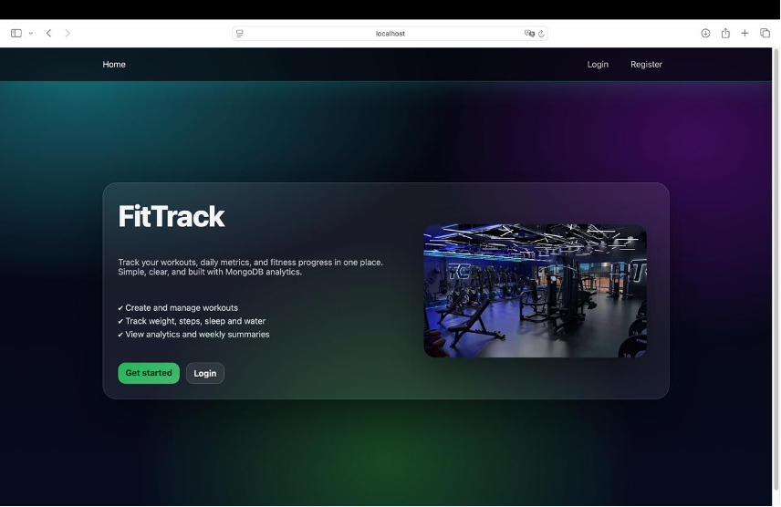

---

## 🔐 Register Page

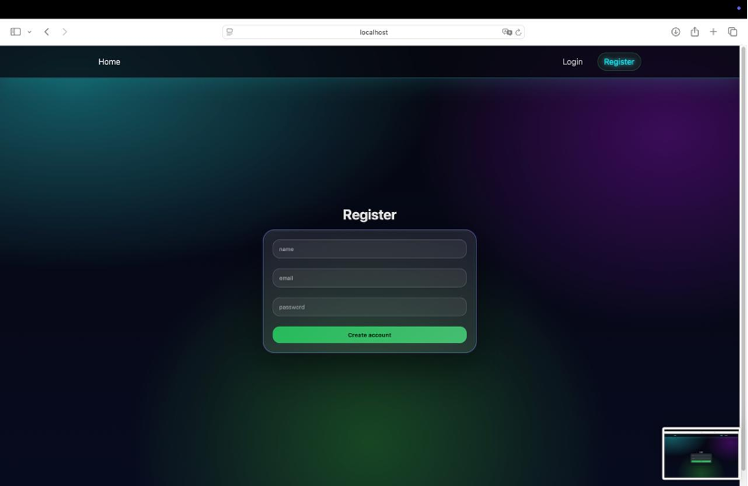

---

## 🔑 Login Page

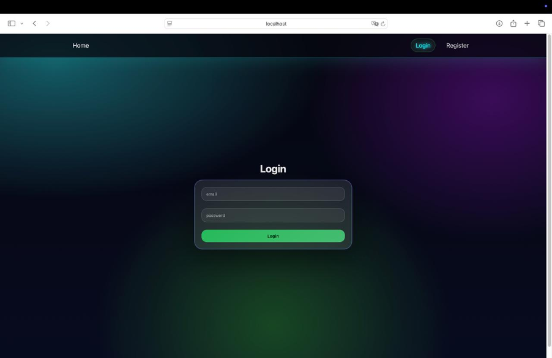

---

## 🏋️ Workouts Page

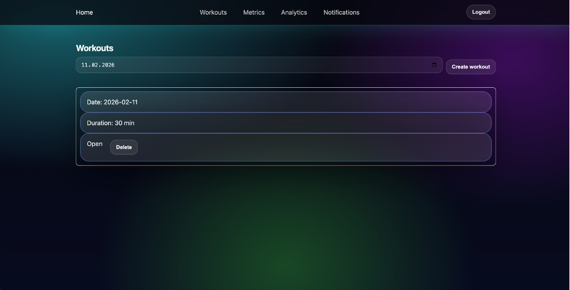

---

## 📄 Workout Details

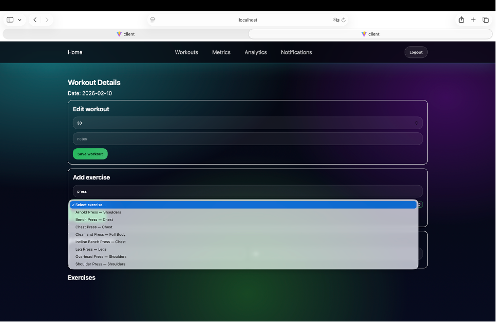

---

## 📊 Metrics Page

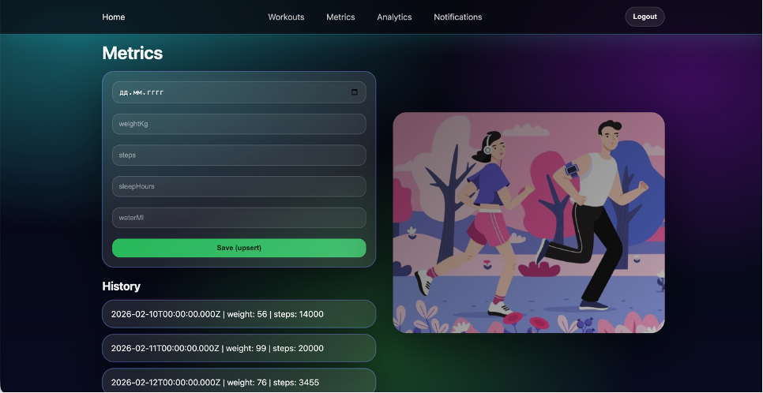

---

## 📈 Metrics History

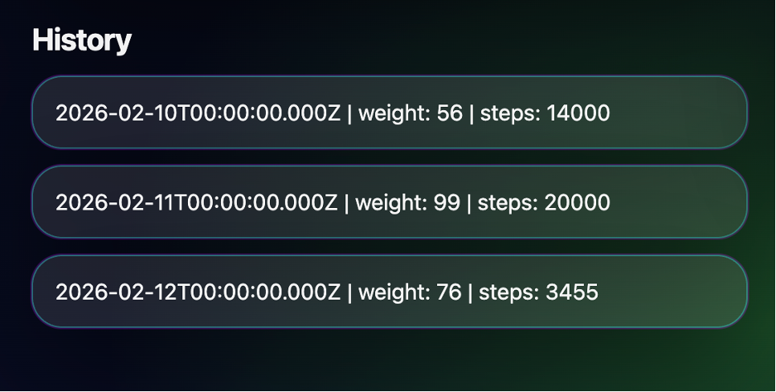

---

## 📉 Analytics Page

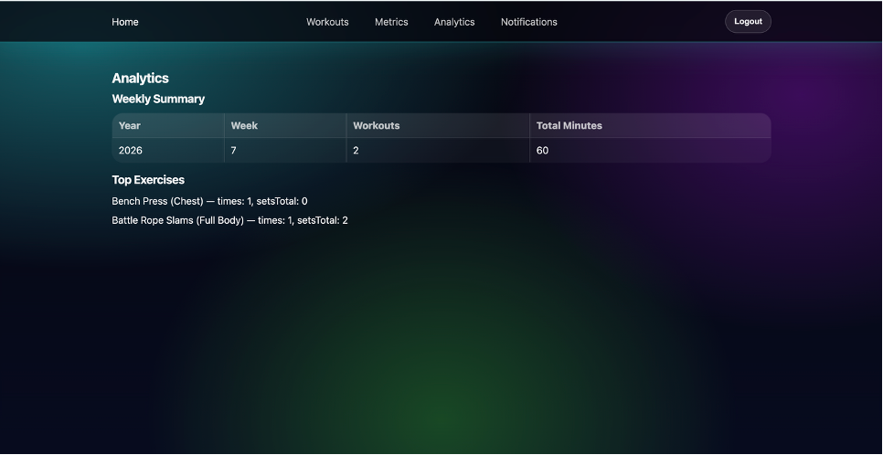

---

## 🛡 RBAC Admin Panel

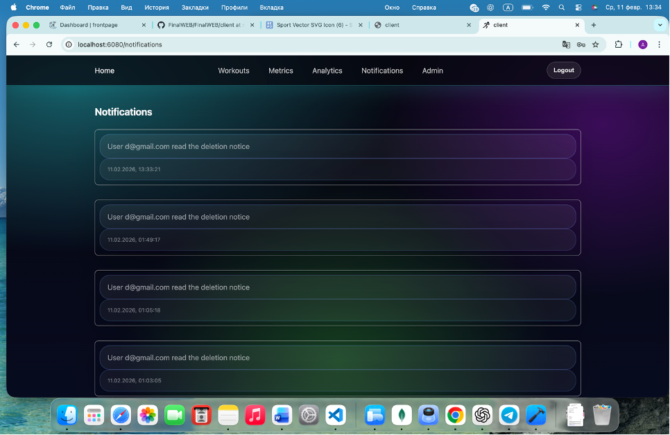

---

## ⚙ Admin Functionality

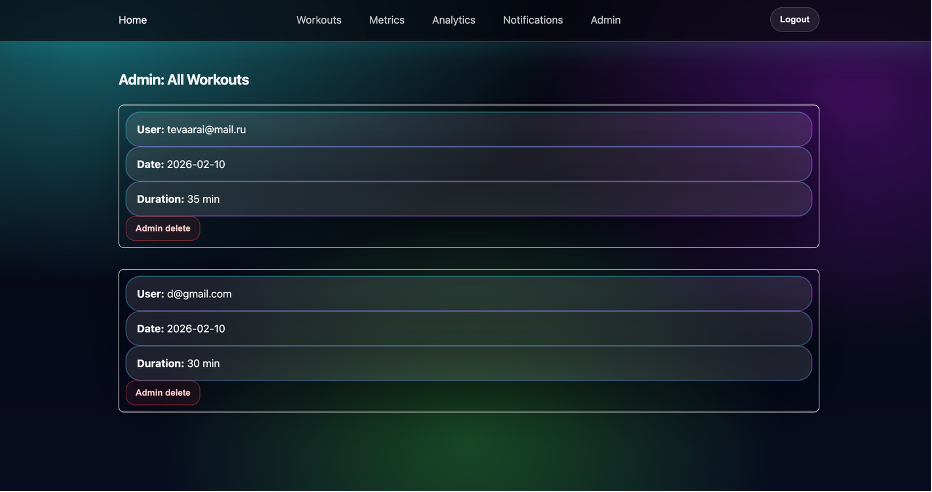

---

## 🔔 Admin Notifications

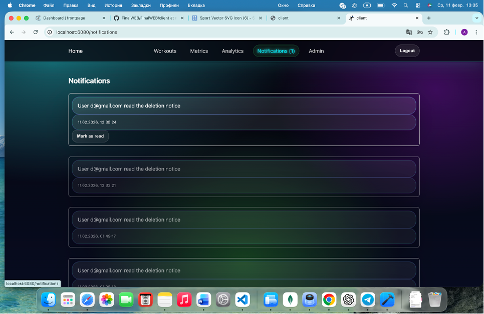

---

## 🗄 MongoDB Atlas Collections

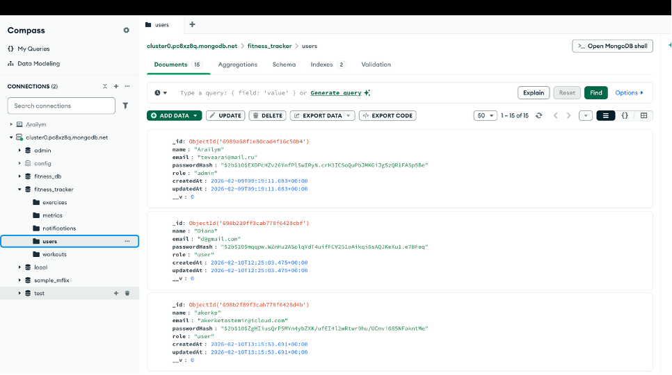

---

## 👩‍💻 Contribution

Tyulebayeva Arailym:
- Backend development (Node.js, Express)  
- MongoDB data modeling  
- CRUD & aggregation pipelines  
- JWT authentication and RBAC  

Mnaidarova Nargiza:
- Frontend development (React)  
- API integration  
- UI/UX design  
- Testing and screenshots  

---

## 🎯 Conclusion

The Fitness Tracker project demonstrates full-stack architecture, REST API development, JWT authentication with RBAC, and advanced MongoDB usage including embedded documents, references, update operators, upsert operations, aggregation pipelines, and indexing.

The project fully satisfies the requirements of the WEB Technologies 2 (Back End) course and demonstrates practical implementation of a secure database-driven web application.